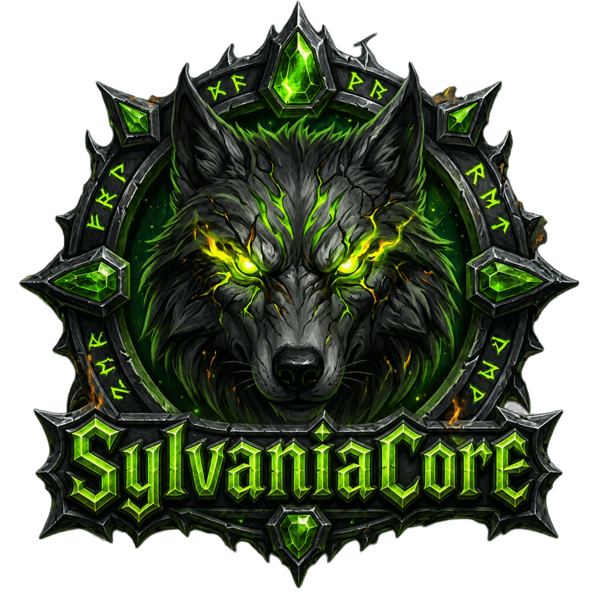

<div align="center">



# SylvaniaCore

**The C++ core of the [La Légion de Sylvania](https://legendesylvania.com) realm**
*World of Warcraft®* server emulator — Legion 7.3.5

🇫🇷 [Français](./README.md) · 🇬🇧 **English**

[](https://github.com/BlaMacfly/SylvaniaCore/wiki)
[](https://discord.gg/qmQBXbuXkx)
[](./LICENSE)
[](https://github.com/BlaMacfly/SylvaniaCore/stargazers)
[](https://github.com/BlaMacfly/SylvaniaCore/network/members)
[](https://github.com/slash-design/DestinyCore)

</div>

---

## 📖 Overview

**SylvaniaCore** is the core that runs **La Légion de Sylvania**, a French-speaking
*World of Warcraft®* realm on **Legion 7.3.5**. It is a fork of
[DestinyCore](https://github.com/slash-design/DestinyCore) (itself descended from the TrinityCore
lineage), continuously maintained and developed for the needs of the realm.

The repository serves both as a **living codebase** and as a **backup** of the production server.

### Philosophy: "adaptive blizzlike"

This is neither a *fun* server nor an *x∞ rates* server. Blizzard's authentic values
(damage, tuning, economy) are **preserved**; the core of the work is **fixing deviations from
blizzlike** rather than softening the game. Every bug found in game is fixed at its source —
in the data or in the core — never worked around with GM commands.

---

## ✨ What SylvaniaCore adds

Beyond the upstream core, the realm brings its own systems:

| Module | Description |
| --- | --- |
| 🤖 **PlayerBots** | Controllable player bots (`src/server/game/PlayerBot`): group orders, tank/heal roles, gear management, automatic battleground filling |
| ⚔️ **Capital Siege** | Daily invasion of the capitals by bot raids, with a designated leader and PvP-flagged players (`src/server/game/CapitalSiege`) |
| 💰 **Mercenaries** | Hireling NPCs: a solo player recruits companions for gold, under contract (`src/server/game/Mercenary`) |
| 🇫🇷 **frFR localization** | Restores the official French texts extracted from the 7.3.5 client (quests, gossip, broadcast texts) and translates missing scripted content |
| 🐛 **Content fixes** | Campaigns, dungeons and quests repaired zone by zone (Mardum, the Wandering Isle, the Vortex Pinnacle…) |

---

## 📚 Documentation

This README is enough to **install and run** a server. Everything else lives in the
**[project wiki](https://github.com/BlaMacfly/SylvaniaCore/wiki)** *(in French)*:

| | |
| --- | --- |
| 🔧 **[Fixing content](https://github.com/BlaMacfly/SylvaniaCore/wiki/Corriger-le-contenu)** | The recurring bug classes of this core — unbound C++ scripts, dead hooks, quests without objectives, loot, leftover phases — and how to find them. **The best starting point for a first contribution.** |
| ⚙️ **[Configuration](https://github.com/BlaMacfly/SylvaniaCore/wiki/Configuration)** | Reference for every realm-specific configuration key |
| 🧩 **[Core architecture](https://github.com/BlaMacfly/SylvaniaCore/wiki/Architecture-du-core)** | Source tree, upstream lineage, architectural pitfalls |
| 🤖 **Modules** | [PlayerBots](https://github.com/BlaMacfly/SylvaniaCore/wiki/Module-PlayerBots) · [Mercenaries](https://github.com/BlaMacfly/SylvaniaCore/wiki/Module-Mercenaires) · [Capital Siege](https://github.com/BlaMacfly/SylvaniaCore/wiki/Module-Siege-des-Capitales) · [Other customs](https://github.com/BlaMacfly/SylvaniaCore/wiki/Autres-customs) |
| 💥 **[Crash diagnosis](https://github.com/BlaMacfly/SylvaniaCore/wiki/Diagnostic-des-crashs)** | Core dumps, jemalloc redzones, false shutdown crashes |
| 🩺 **[Troubleshooting FAQ](https://github.com/BlaMacfly/SylvaniaCore/wiki/FAQ-Depannage)** | Loading screen, missing NPCs, stuck character, unbeatable boss… |
| 🚧 **[Work in progress](https://github.com/BlaMacfly/SylvaniaCore/wiki/Chantiers-en-cours)** | What is open, what is closed, and the **known dead ends** |

---

## 🛠️ Requirements

- **CMake 3.31+**
- **Boost 1.84.0**
- **MySQL 8.0** or **MariaDB 10.6+** (the realm runs on MariaDB 11.4)
- **OpenSSL 3.x**
- **GCC / Clang / MSVC** (Visual Studio 2022 recommended)

Supported platforms: **Linux, Windows, macOS**.

> 📖 Packages to install, client data extraction and compiling on a modest machine:
> **[Installation](https://github.com/BlaMacfly/SylvaniaCore/wiki/Installation)** on the wiki.

---

## 📦 Building

1. Clone the repository:
   ```bash
   git clone https://github.com/BlaMacfly/SylvaniaCore.git
   cd SylvaniaCore
   ```

2. Configure and build:
   ```bash
   cmake -S . -B build -DTOOLS=ON
   cmake --build build -j$(nproc)
   ```

3. Install the databases — see the
   [Database installation](#-database-installation) section below.

4. Start the servers:
   ```bash
   ./bin/worldserver
   ./bin/bnetserver
   ```

> ℹ️ The source code deliberately keeps the internal names inherited from upstream
> (`DestinyCore`, CMake targets, configuration paths) to stay compatible with upstream
> updates and avoid breaking existing deployment scripts.

---

## 💾 Database installation

The repository contains **only the schemas** for `auth`, `characters` and `shop`. The `world` and
`hotfixes` databases are too large to be versioned: they are downloaded from the
**releases of the upstream DestinyCore repository**.

> ⚠️ **Never import the files in `sql/base/dev/`.** They are **empty** structures
> (tables without any data) intended for upstream developers. Importing them gives you a hollow
> `world` database: the worldserver starts, but the client stays stuck on the loading screen.

### 1. Download the upstream database

Get the latest DB release from
[slash-design/DestinyCore/releases](https://github.com/slash-design/DestinyCore/releases)
(currently `DB735.02.rar`, ~84 MB). The archive contains two dumps:

| File | Database | Uncompressed size |
| --- | --- | --- |
| `DB_world_735.02.sql` | `world` | ~375 MB |
| `DB_hotfixes_735.02.sql` | `hotfixes` | ~127 MB |

Both dumps run their own `CREATE DATABASE` followed by `USE` on the names `world` and
`hotfixes`; to use different database names, edit those two lines at the top of each file.

### 2. Create the databases and import

```bash
# auth / characters / world / hotfixes databases
mysql -u root -p < sql/create/create_mysql.sql

# The shop database is not covered by the upstream script
mysql -u root -p -e "CREATE DATABASE shop DEFAULT CHARACTER SET utf8;"

# Schemas shipped with the repository
mysql -u trinity -p auth       < sql/base/auth_database.sql
mysql -u trinity -p characters < sql/base/characters_database.sql
mysql -u trinity -p shop       < sql/base/shop_database.sql

# Full databases from the upstream release
mysql -u trinity -p < DB_world_735.02.sql
mysql -u trinity -p < DB_hotfixes_735.02.sql
```

### 3. Let the core apply the updates

Do **not** import anything from `sql/updates/` by hand. In `worldserver.conf`:

```ini
Updates.EnableDatabases = 31   # auth + characters + world + hotfixes + shop
Updates.AutoSetup       = 1
```

On first start, the worldserver applies the roughly 330 files in `sql/updates/world` by itself,
as well as those for `characters` and `hotfixes`. The `updates` table in the upstream dumps
ships empty: this is expected, the whole history is replayed. Allow several minutes.

### 4. Realm content fixes (optional)

`sql/sylvania/` is the versioned record of the data fixes applied to the realm's database
(artifacts, campaigns, dungeons, Mercenaries and Capital Siege modules…). They are independent
of the automatic update mechanism and are imported by hand, in chronological order, once the
previous steps are done. **Each file states its target database in its header: the folder
does not have a single one.** Details and conventions: **[Databases](https://github.com/BlaMacfly/SylvaniaCore/wiki/Bases-de-donnees)**.

### 🩺 Stuck on the loading screen?

These two messages appear on every login on **all** servers of this lineage and are
**not** errors:

```text
Client tried to call not implemented method ResourceService.GetContentHandle
Received not handled opcode [CMSG_GET_ACCOUNT_CHARACTER_LIST ...]
```

`ResourceService` is a Battle.net service that remained a stub upstream, and
`CMSG_GET_ACCOUNT_CHARACTER_LIST` (the cross-realm character list) is deliberately declared
`STATUS_UNHANDLED` in `src/server/game/Server/Protocol/Opcodes.cpp`.

The cause is almost always a badly imported `world` or `hotfixes` database — reread the warning
about `sql/base/dev/` above. Other leads (client cache, extracted data, reading
`DBErrors.log`) are covered in the **[Troubleshooting FAQ](https://github.com/BlaMacfly/SylvaniaCore/wiki/FAQ-Depannage)**, along with
other common symptoms.

---

## 🌍 Join the realm

The game server is open, and the official website explains how to connect:
**[legendesylvania.com](https://legendesylvania.com)**

---

## 🤝 Contributing

Contributions are welcome — bug fixes, documentation improvements
or new features:

1. Fork the repository
2. Create a dedicated branch
3. Open a pull request against `sylvaniacore`

> 📖 Repository conventions, commit style, SQL rules and fixing doctrine:
> **[Contributing](https://github.com/BlaMacfly/SylvaniaCore/wiki/Contribuer)** on the wiki.

A Discord is open **to contributors and anyone who wants to take part in developing the
core**: it is the place to discuss a fix before diving in, ask questions about the architecture
or get a PR reviewed. (It is not the realm's players' Discord.)

<a href="https://discord.gg/qmQBXbuXkx"></a>

---

## 🐛 Reporting an issue

Open a ticket on the [issue tracker](https://github.com/BlaMacfly/SylvaniaCore/issues).
Please check first that an identical report does not already exist.

---

## 🙏 Acknowledgements

SylvaniaCore would not exist without the work of the projects it descends from:

- [DestinyCore](https://github.com/slash-design/DestinyCore) — the upstream core this repository is forked from
- [TrinityCore](https://github.com/TrinityCore/TrinityCore) — the original lineage
- [**ArgusCore**](https://github.com/Trion-Control-Panel/ArgusCore), the project by
  [FlyingPhoenix](https://github.com/fIyingPhoenix) — a major reference for SylvaniaCore.
  A considerable amount of work has gone into its engine, network layer and class mechanics
  for 7.3.5; we regularly draw on it to restore whole parts of the core.
  Thank you for everything that is openly shared.
- [mod-playerbots](https://github.com/liyunfan1223/mod-playerbots) — reference for player bot logic

Upstream repository CI status:
[](https://github.com/slash-design/DestinyCore/actions/workflows/win-x64-build.yml)
[](https://github.com/slash-design/DestinyCore/actions/workflows/gcc-build.yml)
[](https://github.com/slash-design/DestinyCore/actions/workflows/clang-build.yml)

---

## 📜 License

Distributed under **GPL v2.0**. See the [LICENSE](./LICENSE) file.

*World of Warcraft® and Blizzard Entertainment® are registered trademarks of Blizzard Entertainment, Inc.
This project is not affiliated with or endorsed by Blizzard Entertainment.*

---

<div align="center">


⭐ If you like SylvaniaCore, give the project a star!

</div>
