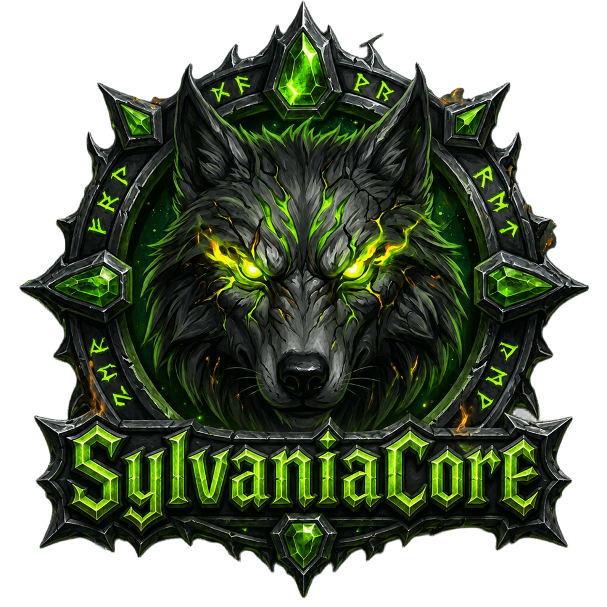

<div align="center">



# SylvaniaCore

**Le core C++ du royaume [La Légion de Sylvania](https://legendesylvania.com)**
Fork de [DestinyCore](https://github.com/slash-design/DestinyCore) — World of Warcraft® Legion 7.3.5

[](./LICENSE)
[](https://github.com/BlaMacfly/SylvaniaCore/stargazers)
[](https://github.com/BlaMacfly/SylvaniaCore/network/members)

</div>

---

## 🚀 Build Status

Windows | GCC | Clang
:------------: | :------------: | :------------:
[](https://github.com/slash-design/DestinyCore/actions/workflows/win-x64-build.yml) | [](https://github.com/slash-design/DestinyCore/actions/workflows/gcc-build.yml) | [](https://github.com/slash-design/DestinyCore/actions/workflows/clang-build.yml)

---

## 📖 Introduction

**DestinyCore** is a modern, modular **MMORPG server framework** written in C++ that supports **multiple platforms** (Windows, Linux, macOS) and builds cleanly with **GCC, Clang, and MSVC**.  

It is designed to be **lightweight, scalable, and extensible**, providing developers and server administrators with a stable foundation for World of Warcraft® (Legion 7.3.5) and beyond.  

Key goals of DestinyCore:
- ⚡ Modern C++ design (C++20+)
- 🔌 Modular architecture (authserver, worldserver, shared libs)
- 🤖 Integrated **PlayerBots** system
- 🌍 Multi-database support (auth, characters, world)
- 🛠️ Easy build system (CMake + GitHub Actions CI)
- 🎮 MMO-ready networking with scalability in mind

---

## 🛠️ Requirements

DestinyCore depends on modern development tools and libraries:

- **CMake 3.31+**
- **Boost 1.84.0**
- **MySQL 8.0**
- **OpenSSL 3.x**
- **GCC / Clang / MSVC (Visual Studio 2022 recommended)**

---

## 📦 Installation

1. Clone the repository:
   ```bash
   git clone https://github.com/slash-design/DestinyCore.git
   cd DestinyCore
   ```

2. Create a build directory:
   ```bash
   cmake -S . -B build -DTOOLS=ON
   cmake --build build
   ```

3. Configure your databases (`auth`, `characters`, `world`) and import the SQL structures provided in `/sql/base`.

4. Start the servers:
   ```bash
   ./bin/worldserver
   ./bin/bnetserver
   ```

---

## 🤝 Contributing

We welcome all contributions!  
Whether you’re fixing a bug, improving documentation, or adding new features — PRs are always appreciated.

- Fork the repo  
- Create a feature branch  
- Submit a pull request  

---

## 🐛 Reporting Issues

Issues can be reported directly via the [GitHub Issue Tracker](https://github.com/slash-design/DestinyCore/issues).  
Before creating a new one, please check for existing reports to avoid duplicates.

---

## 📜 License

This project is licensed under **GPL v2.0**.  
See the [LICENSE](./LICENSE) file for details.

---

## 🌐 Links

- 📂 [GitHub Repository](https://github.com/slash-design/DestinyCore)
- 📌 [Issues](https://github.com/slash-design/DestinyCore/issues)
- 📖 [Documentation (WIP)](https://github.com/slash-design/DestinyCore/wiki)

---

<div align="center">


⭐ Si SylvaniaCore vous plaît, laissez une étoile au projet sur GitHub !

</div>
